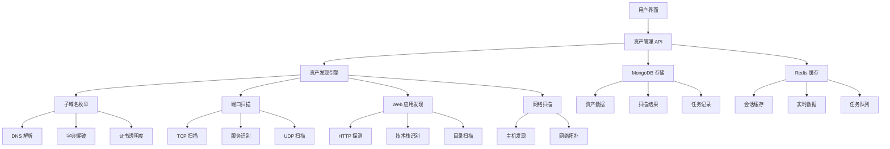

# 星络 (Stellar) 开发计划

<div align="center">


**分布式安全资产管理平台开发路线图**

</div>

---

## 📋 项目概述

**星络 (Stellar)** 是一个现代化的分布式安全资产管理和漏洞扫描平台，采用 Go + Svelte 5 技术栈构建。本开发计划重点关注**资产收集功能**的实现，这是整个平台的核心基础功能。

### 🎯 开发目标

- **阶段性目标**: 优先完成资产收集功能
- **技术重构**: 从 Python/Vue 重构到 Go/Svelte 5
- **架构优化**: 采用分布式架构，提升性能和可扩展性
- **用户体验**: 提供现代化的用户界面和交互体验

---

## 🚀 开发阶段规划

### 阶段 1: 基础架构搭建 (已完成 90%)

**目标**: 建立完整的项目基础架构和开发环境

#### 后端基础架构 ✅
- [x] **项目结构**: 标准 Go 项目结构
- [x] **Web 框架**: Gin 框架集成
- [x] **数据库**: MongoDB + Redis 连接
- [x] **配置管理**: YAML 配置文件
- [x] **日志系统**: zerolog 日志框架
- [x] **认证系统**: JWT 认证机制
- [x] **中间件**: 认证、跨域、日志中间件

#### 前端基础架构 ✅
- [x] **项目结构**: SvelteKit 项目结构
- [x] **构建系统**: Vite 构建工具
- [x] **UI 组件**: shadcn-svelte 组件库
- [x] **样式系统**: Tailwind CSS
- [x] **状态管理**: Svelte 5 runes
- [x] **API 客户端**: Axios 配置
- [x] **路由系统**: SvelteKit 路由

#### 开发环境 ✅
- [x] **开发脚本**: Makefile 和脚本
- [x] **热重载**: 前后端热重载
- [x] **代码格式**: Go fmt + Prettier
- [x] **测试框架**: Go test + Vitest
- [x] **部署配置**: Docker 和传统部署

### 阶段 2: 核心资产收集功能 (进行中 70%)

**目标**: 实现完整的资产收集功能，包括资产发现、管理和监控

#### 2.1 资产数据模型 ✅
- [x] **资产类型定义**: 域名、子域名、IP、端口、URL、应用资产
- [x] **数据库模型**: MongoDB 集合设计
- [x] **资产关系**: 资产间关联关系
- [x] **Repository 模式**: 数据访问层

#### 2.2 资产管理 API ✅
- [x] **CRUD 操作**: 创建、读取、更新、删除资产
- [x] **批量操作**: 批量创建、删除资产
- [x] **查询接口**: 分页、筛选、搜索
- [x] **导入导出**: CSV/JSON 格式导入导出
- [x] **统计接口**: 资产统计和分析

#### 2.3 子域名枚举 🔄
- [x] **DNS 解析**: 基于 DNS 的子域名发现
- [x] **字典爆破**: 子域名字典爆破
- [x] **证书透明度**: CT 日志子域名发现
- [x] **泛解析检测**: 泛解析域名检测
- [x] **任务管理**: 异步任务处理
- [ ] **多源聚合**: 集成更多子域名发现源
- [ ] **智能去重**: 高效的重复域名过滤

#### 2.4 端口扫描 🔄
- [x] **TCP 扫描**: 高效的 TCP 端口扫描
- [x] **服务识别**: 端口服务指纹识别
- [x] **并发控制**: 可配置的并发数控制
- [x] **扫描结果**: 详细的扫描结果记录
- [ ] **UDP 扫描**: UDP 端口扫描支持
- [ ] **高级识别**: 更精确的服务识别
- [ ] **扫描优化**: 扫描速度和准确性优化

#### 2.5 Web 应用发现 🔄
- [x] **HTTP 探测**: Web 应用基础探测
- [x] **技术栈识别**: 自动识别 Web 技术栈
- [x] **标题获取**: 网页标题和基础信息
- [x] **响应分析**: HTTP 响应头分析
- [ ] **目录扫描**: Web 目录和文件扫描
- [ ] **爬虫功能**: 深度 Web 内容爬取
- [ ] **API 发现**: REST API 端点发现

#### 2.6 资产发现引擎 🔄
- [x] **网络扫描**: 网络段主机发现
- [x] **服务发现**: 网络服务自动发现
- [x] **结果聚合**: 多种发现结果聚合
- [x] **任务调度**: 分布式任务调度
- [ ] **智能关联**: 资产间智能关联分析
- [ ] **增量发现**: 增量资产发现
- [ ] **规则引擎**: 可配置的发现规则

#### 2.7 前端资产管理界面 🔄
- [x] **资产列表**: 资产列表展示和筛选
- [x] **资产详情**: 资产详细信息展示
- [x] **批量操作**: 批量资产操作界面
- [x] **实时更新**: 实时资产状态更新
- [ ] **可视化图表**: 资产统计图表
- [ ] **搜索功能**: 高级搜索和筛选
- [ ] **导入导出**: 文件导入导出界面

### 阶段 3: 资产收集优化 (计划中 0%)

**目标**: 优化资产收集性能，增强功能完整性

#### 3.1 性能优化 📅
- [ ] **并发优化**: 优化扫描并发控制
- [ ] **内存优化**: 降低内存使用
- [ ] **数据库优化**: 优化数据库查询
- [ ] **缓存策略**: 实现智能缓存
- [ ] **限流控制**: 防止过载的限流机制

#### 3.2 分布式扫描 📅
- [ ] **节点管理**: 分布式节点管理
- [ ] **任务分发**: 智能任务分发
- [ ] **负载均衡**: 节点负载均衡
- [ ] **结果聚合**: 分布式结果聚合
- [ ] **故障恢复**: 节点故障恢复

#### 3.3 监控告警 📅
- [ ] **资产监控**: 资产状态变化监控
- [ ] **告警规则**: 可配置告警规则
- [ ] **通知系统**: 多渠道通知系统
- [ ] **实时大屏**: 实时监控大屏
- [ ] **历史分析**: 历史数据分析

#### 3.4 数据质量 📅
- [ ] **去重算法**: 高效的数据去重
- [ ] **数据清洗**: 自动数据清洗
- [ ] **质量评估**: 数据质量评估
- [ ] **数据验证**: 资产数据验证
- [ ] **异常检测**: 异常数据检测

### 阶段 4: 扩展功能 (计划中 0%)

**目标**: 基于资产收集功能，扩展更多安全功能

#### 4.1 漏洞扫描 📅
- [ ] **漏洞插件**: 可扩展的漏洞扫描插件
- [ ] **CVE 集成**: CVE 数据库集成
- [ ] **漏洞验证**: 漏洞自动验证
- [ ] **风险评估**: 漏洞风险评估
- [ ] **报告生成**: 漏洞扫描报告

#### 4.2 敏感信息检测 📅
- [ ] **信息泄露**: 敏感信息泄露检测
- [ ] **API 密钥**: API 密钥泄露检测
- [ ] **配置检查**: 安全配置检查
- [ ] **源码扫描**: 源代码安全扫描
- [ ] **合规检查**: 合规性检查

#### 4.3 插件系统 📅
- [ ] **插件框架**: 完整的插件开发框架
- [ ] **YAML 插件**: YAML 声明式插件
- [ ] **Go 插件**: Go 编译型插件
- [ ] **Python 插件**: Python 脚本型插件
- [ ] **插件市场**: 插件分享和市场

---

## 🎯 当前开发重点: 资产收集功能

### 📊 资产收集功能架构



### 🔧 核心技术实现

#### 1. 资产数据模型设计

```go
// 基础资产模型
type BaseAsset struct {
    ID           primitive.ObjectID `bson:"_id,omitempty" json:"id"`
    CreatedAt    time.Time          `bson:"createdAt" json:"createdAt"`
    UpdatedAt    time.Time          `bson:"updatedAt" json:"updatedAt"`
    LastScanTime time.Time          `bson:"lastScanTime" json:"lastScanTime"`
    Type         AssetType          `bson:"type" json:"type"`
    ProjectID    primitive.ObjectID `bson:"projectId" json:"projectId"`
    Tags         []string           `bson:"tags" json:"tags"`
    TaskName     string             `bson:"taskName" json:"taskName"`
    RootDomain   string             `bson:"rootDomain" json:"rootDomain"`
}

// 子域名资产
type SubdomainAsset struct {
    BaseAsset `bson:",inline"`
    Host      string   `bson:"host" json:"host"`
    IPs       []string `bson:"ips" json:"ips"`
    CNAME     string   `bson:"cname" json:"cname"`
    TakeOver  bool     `bson:"takeOver" json:"takeOver"`
}

// 端口资产
type PortAsset struct {
    BaseAsset `bson:",inline"`
    Host      string `bson:"host" json:"host"`
    Port      int    `bson:"port" json:"port"`
    Protocol  string `bson:"protocol" json:"protocol"`
    Service   string `bson:"service" json:"service"`
    Version   string `bson:"version" json:"version"`
    Banner    string `bson:"banner" json:"banner"`
}

// URL 资产
type URLAsset struct {
    BaseAsset `bson:",inline"`
    URL       string `bson:"url" json:"url"`
    Title     string `bson:"title" json:"title"`
    Status    int    `bson:"status" json:"status"`
    Length    int    `bson:"length" json:"length"`
    Server    string `bson:"server" json:"server"`
}
```

#### 2. 资产发现引擎

```go
// 资产发现服务
type DiscoveryService struct {
    db            *mongo.Database
    limiter       *rate.Limiter
    taskMap       map[string]*DiscoveryTask
    taskMutex     sync.RWMutex
    resultHandler ResultHandler
}

// 发现任务
type DiscoveryTask struct {
    ID         string
    Task       *models.AssetDiscoveryTask
    Context    context.Context
    CancelFunc context.CancelFunc
    Progress   float64
    Status     string
    Results    []*models.DiscoveryResult
}

// 执行资产发现
func (s *DiscoveryService) runTask(task *DiscoveryTask) {
    switch task.Task.DiscoveryType {
    case "network":
        err = s.runNetworkDiscovery(task)
    case "service":
        err = s.runServiceDiscovery(task)
    case "web":
        err = s.runWebDiscovery(task)
    default:
        err = s.runNetworkDiscovery(task)
    }
}
```

#### 3. 前端资产管理

```typescript
// 资产 API 客户端
export const assetApi = {
  // 获取资产列表
  async getAssets(params: AssetQueryParams): Promise<AssetListResult> {
    const response = await api.get('/assets/assets', { params });
    return response.data.data;
  },

  // 创建资产
  async createAsset(data: CreateAssetRequest): Promise<Asset> {
    const response = await api.post('/assets/assets', data);
    return response.data.data;
  },

  // 批量创建资产
  async batchCreateAssets(data: BatchCreateAssetsRequest): Promise<BatchResult> {
    const response = await api.post('/assets/batch', data);
    return response.data.data;
  }
};

// 资产状态管理
export const assetStore = writable<{
  assets: Asset[];
  loading: boolean;
  selectedAsset: Asset | null;
}>({
  assets: [],
  loading: false,
  selectedAsset: null
});
```

---

## 📈 开发进度跟踪

### 当前进度概览

| 功能模块 | 进度 | 状态 | 预计完成时间 |
|---------|------|------|------------|
| **基础架构** | 90% | ✅ 已完成 | 2024-01-15 |
| **资产数据模型** | 100% | ✅ 已完成 | 2024-01-20 |
| **资产管理 API** | 100% | ✅ 已完成 | 2024-01-25 |
| **子域名枚举** | 80% | 🔄 进行中 | 2024-02-01 |
| **端口扫描** | 75% | 🔄 进行中 | 2024-02-05 |
| **Web 应用发现** | 65% | 🔄 进行中 | 2024-02-10 |
| **资产发现引擎** | 70% | 🔄 进行中 | 2024-02-15 |
| **前端资产界面** | 60% | 🔄 进行中 | 2024-02-20 |
| **性能优化** | 0% | 📅 计划中 | 2024-03-01 |
| **分布式扫描** | 0% | 📅 计划中 | 2024-03-15 |

### 近期开发任务 (接下来 2 周)

#### 第 1 周 (2024-01-29 - 2024-02-04)

**主要任务**: 完善子域名枚举和端口扫描功能

##### 子域名枚举优化
- [ ] **多源聚合**: 集成更多子域名发现源
  - [ ] SecurityTrails API 集成
  - [ ] VirusTotal API 集成
  - [ ] 搜索引擎子域名收集
  - [ ] 社交媒体子域名收集

- [ ] **智能去重**: 实现高效的重复域名过滤
  - [ ] 基于 Bloom Filter 的快速去重
  - [ ] 相似域名检测和归并
  - [ ] 历史数据对比去重

- [ ] **结果验证**: 增强子域名结果验证
  - [ ] DNS 记录验证
  - [ ] HTTP 状态验证
  - [ ] 域名有效性检测

##### 端口扫描增强
- [ ] **UDP 扫描**: 添加 UDP 端口扫描支持
  - [ ] UDP 扫描算法实现
  - [ ] 常见 UDP 服务识别
  - [ ] UDP 响应解析

- [ ] **高级识别**: 提升服务识别准确性
  - [ ] 服务指纹库扩展
  - [ ] 版本信息提取
  - [ ] 服务配置检测

##### 测试和修复
- [ ] **单元测试**: 完善测试用例
- [ ] **集成测试**: 端到端测试
- [ ] **性能测试**: 扫描性能测试
- [ ] **Bug 修复**: 修复已知问题

#### 第 2 周 (2024-02-05 - 2024-02-11)

**主要任务**: 完善 Web 应用发现和前端界面

##### Web 应用发现
- [ ] **目录扫描**: 实现 Web 目录和文件扫描
  - [ ] 目录字典管理
  - [ ] 递归扫描支持
  - [ ] 状态码过滤
  - [ ] 响应内容分析

- [ ] **爬虫功能**: 深度 Web 内容爬取
  - [ ] 页面链接提取
  - [ ] JavaScript 渲染支持
  - [ ] 表单发现和分析
  - [ ] 资源文件收集

- [ ] **API 发现**: REST API 端点发现
  - [ ] Swagger 文档解析
  - [ ] API 端点猜测
  - [ ] GraphQL 端点发现
  - [ ] API 版本识别

##### 前端界面优化
- [ ] **可视化图表**: 资产统计图表
  - [ ] 资产类型分布图
  - [ ] 发现趋势图
  - [ ] 地理位置分布图
  - [ ] 技术栈统计图

- [ ] **搜索功能**: 高级搜索和筛选
  - [ ] 多字段搜索
  - [ ] 条件组合搜索
  - [ ] 保存搜索条件
  - [ ] 搜索历史记录

- [ ] **导入导出**: 文件导入导出界面
  - [ ] 拖拽上传支持
  - [ ] 格式验证
  - [ ] 导入进度显示
  - [ ] 导出格式选择

---

## 🛠️ 技术实现细节

### 资产收集核心算法

#### 1. 子域名枚举算法

```go
// 子域名枚举服务
type SubdomainEnumService struct {
    resolvers    []string
    timeout      time.Duration
    concurrency  int
    dictPath     string
    enableCT     bool
    enableDNS    bool
    enableBrute  bool
}

// 执行子域名枚举
func (s *SubdomainEnumService) EnumerateSubdomains(ctx context.Context, domain string) (<-chan *SubdomainResult, error) {
    resultChan := make(chan *SubdomainResult, 1000)
    var wg sync.WaitGroup

    // DNS 解析发现
    if s.enableDNS {
        wg.Add(1)
        go func() {
            defer wg.Done()
            s.dnsEnumeration(ctx, domain, resultChan)
        }()
    }

    // 证书透明度发现
    if s.enableCT {
        wg.Add(1)
        go func() {
            defer wg.Done()
            s.ctEnumeration(ctx, domain, resultChan)
        }()
    }

    // 字典爆破
    if s.enableBrute {
        wg.Add(1)
        go func() {
            defer wg.Done()
            s.bruteForceEnumeration(ctx, domain, resultChan)
        }()
    }

    // 等待所有任务完成
    go func() {
        wg.Wait()
        close(resultChan)
    }()

    return resultChan, nil
}

// DNS 解析枚举
func (s *SubdomainEnumService) dnsEnumeration(ctx context.Context, domain string, resultChan chan<- *SubdomainResult) {
    // 常见子域名列表
    commonSubdomains := []string{
        "www", "mail", "ftp", "admin", "api", "app", "blog", "dev", "test",
        "staging", "beta", "alpha", "demo", "preview", "static", "media",
        "assets", "cdn", "img", "images", "js", "css", "uploads", "files",
    }

    // 并发 DNS 查询
    semaphore := make(chan struct{}, s.concurrency)
    var wg sync.WaitGroup

    for _, subdomain := range commonSubdomains {
        select {
        case <-ctx.Done():
            return
        default:
        }

        wg.Add(1)
        go func(sub string) {
            defer wg.Done()
            semaphore <- struct{}{}
            defer func() { <-semaphore }()

            fullDomain := sub + "." + domain
            result := s.resolveSubdomain(ctx, fullDomain)
            if result != nil {
                resultChan <- result
            }
        }(subdomain)
    }

    wg.Wait()
}

// 解析子域名
func (s *SubdomainEnumService) resolveSubdomain(ctx context.Context, domain string) *SubdomainResult {
    resolver := &net.Resolver{
        PreferGo: true,
        Dial: func(ctx context.Context, network, address string) (net.Conn, error) {
            d := net.Dialer{
                Timeout: s.timeout,
            }
            return d.DialContext(ctx, network, s.resolvers[0])
        },
    }

    ips, err := resolver.LookupIPAddr(ctx, domain)
    if err != nil {
        return nil
    }

    var ipStrings []string
    for _, ip := range ips {
        ipStrings = append(ipStrings, ip.IP.String())
    }

    return &SubdomainResult{
        Subdomain:  domain,
        IPs:        ipStrings,
        IsResolved: true,
        Source:     "dns",
        Timestamp:  time.Now(),
    }
}
```

#### 2. 端口扫描算法

```go
// 端口扫描服务
type PortScanService struct {
    timeout     time.Duration
    concurrency int
    rateLimit   int
    limiter     *rate.Limiter
}

// 执行端口扫描
func (s *PortScanService) ScanPorts(ctx context.Context, target string, ports []int) (<-chan *PortResult, error) {
    resultChan := make(chan *PortResult, len(ports))
    semaphore := make(chan struct{}, s.concurrency)
    var wg sync.WaitGroup

    for _, port := range ports {
        select {
        case <-ctx.Done():
            break
        default:
        }

        wg.Add(1)
        go func(p int) {
            defer wg.Done()
            semaphore <- struct{}{}
            defer func() { <-semaphore }()

            // 限流控制
            s.limiter.Wait(ctx)

            result := s.scanPort(ctx, target, p)
            if result != nil {
                resultChan <- result
            }
        }(port)
    }

    go func() {
        wg.Wait()
        close(resultChan)
    }()

    return resultChan, nil
}

// 扫描单个端口
func (s *PortScanService) scanPort(ctx context.Context, host string, port int) *PortResult {
    address := fmt.Sprintf("%s:%d", host, port)
    conn, err := net.DialTimeout("tcp", address, s.timeout)
    if err != nil {
        return &PortResult{
            Host:   host,
            Port:   port,
            Status: "closed",
        }
    }
    defer conn.Close()

    // 服务识别
    service := s.identifyService(conn, port)
    banner := s.grabBanner(conn)

    return &PortResult{
        Host:      host,
        Port:      port,
        Status:    "open",
        Service:   service,
        Banner:    banner,
        Timestamp: time.Now(),
    }
}

// 服务识别
func (s *PortScanService) identifyService(conn net.Conn, port int) string {
    // 基于端口号的服务识别
    serviceMap := map[int]string{
        21:    "ftp",
        22:    "ssh",
        23:    "telnet",
        25:    "smtp",
        53:    "dns",
        80:    "http",
        110:   "pop3",
        143:   "imap",
        443:   "https",
        993:   "imaps",
        995:   "pop3s",
        1433:  "mssql",
        3306:  "mysql",
        3389:  "rdp",
        5432:  "postgresql",
        6379:  "redis",
        27017: "mongodb",
    }

    if service, ok := serviceMap[port]; ok {
        return service
    }

    // 基于 Banner 的服务识别
    banner := s.grabBanner(conn)
    return s.identifyServiceByBanner(banner)
}

// Banner 抓取
func (s *PortScanService) grabBanner(conn net.Conn) string {
    conn.SetReadDeadline(time.Now().Add(3 * time.Second))
    
    buffer := make([]byte, 1024)
    n, err := conn.Read(buffer)
    if err != nil {
        return ""
    }
    
    return string(buffer[:n])
}
```

#### 3. Web 应用发现算法

```go
// Web 应用发现服务
type WebDiscoveryService struct {
    client      *http.Client
    timeout     time.Duration
    userAgent   string
    concurrency int
}

// 发现 Web 应用
func (s *WebDiscoveryService) DiscoverWebApps(ctx context.Context, urls []string) (<-chan *WebAppResult, error) {
    resultChan := make(chan *WebAppResult, len(urls))
    semaphore := make(chan struct{}, s.concurrency)
    var wg sync.WaitGroup

    for _, url := range urls {
        wg.Add(1)
        go func(u string) {
            defer wg.Done()
            semaphore <- struct{}{}
            defer func() { <-semaphore }()

            result := s.analyzeWebApp(ctx, u)
            if result != nil {
                resultChan <- result
            }
        }(url)
    }

    go func() {
        wg.Wait()
        close(resultChan)
    }()

    return resultChan, nil
}

// 分析 Web 应用
func (s *WebDiscoveryService) analyzeWebApp(ctx context.Context, url string) *WebAppResult {
    req, err := http.NewRequestWithContext(ctx, "GET", url, nil)
    if err != nil {
        return nil
    }

    req.Header.Set("User-Agent", s.userAgent)
    
    resp, err := s.client.Do(req)
    if err != nil {
        return nil
    }
    defer resp.Body.Close()

    body, err := io.ReadAll(resp.Body)
    if err != nil {
        return nil
    }

    result := &WebAppResult{
        URL:        url,
        StatusCode: resp.StatusCode,
        Title:      s.extractTitle(body),
        Server:     resp.Header.Get("Server"),
        Headers:    resp.Header,
        Body:       string(body),
        Timestamp:  time.Now(),
    }

    // 技术栈识别
    result.Technologies = s.identifyTechnologies(body, resp.Header)
    
    // 提取链接
    result.Links = s.extractLinks(body, url)
    
    return result
}

// 提取网页标题
func (s *WebDiscoveryService) extractTitle(body []byte) string {
    re := regexp.MustCompile(`<title[^>]*>(.*?)</title>`)
    matches := re.FindSubmatch(body)
    if len(matches) > 1 {
        return string(matches[1])
    }
    return ""
}

// 识别技术栈
func (s *WebDiscoveryService) identifyTechnologies(body []byte, headers http.Header) []string {
    var technologies []string
    
    bodyStr := string(body)
    
    // 基于内容的技术识别
    techPatterns := map[string]string{
        "WordPress":  `wp-content|wp-includes|wordpress`,
        "Joomla":     `joomla|option=com_`,
        "Drupal":     `drupal|sites/all/modules`,
        "Laravel":    `laravel|app\.js|mix-manifest`,
        "Django":     `django|csrftoken`,
        "Flask":      `flask|werkzeug`,
        "Express":    `express|x-powered-by.*express`,
        "React":      `react|__react|data-reactroot`,
        "Vue":        `vue\.js|__vue__|v-if|v-for`,
        "Angular":    `angular|ng-version|ng-app`,
        "Bootstrap":  `bootstrap|btn-primary|container-fluid`,
        "jQuery":     `jquery|\\$\\(|jQuery`,
    }
    
    for tech, pattern := range techPatterns {
        if matched, _ := regexp.MatchString(`(?i)`+pattern, bodyStr); matched {
            technologies = append(technologies, tech)
        }
    }
    
    // 基于 HTTP 头的技术识别
    server := headers.Get("Server")
    if server != "" {
        if matched, _ := regexp.MatchString(`(?i)nginx`, server); matched {
            technologies = append(technologies, "Nginx")
        }
        if matched, _ := regexp.MatchString(`(?i)apache`, server); matched {
            technologies = append(technologies, "Apache")
        }
    }
    
    return technologies
}
```

---

## 🎯 优先级任务清单

### 高优先级 (P0) - 必须完成

#### 子域名枚举完善
- [ ] **多源聚合**: 集成 SecurityTrails, VirusTotal, 搜索引擎
- [ ] **智能去重**: 基于 Bloom Filter 的高效去重
- [ ] **结果验证**: DNS 记录和 HTTP 状态验证
- [ ] **泛解析优化**: 更精确的泛解析检测
- [ ] **性能优化**: 并发控制和内存优化

#### 端口扫描增强
- [ ] **UDP 扫描**: 完整的 UDP 端口扫描支持
- [ ] **服务识别**: 扩展服务指纹库
- [ ] **版本检测**: 服务版本信息提取
- [ ] **扫描优化**: 提升扫描速度和准确性
- [ ] **结果存储**: 优化扫描结果存储

#### Web 应用发现
- [ ] **目录扫描**: 实现 Web 目录和文件扫描
- [ ] **爬虫功能**: 深度 Web 内容爬取
- [ ] **API 发现**: REST API 端点发现
- [ ] **技术栈识别**: 更准确的技术栈识别
- [ ] **响应分析**: 深度 HTTP 响应分析

### 中优先级 (P1) - 重要功能

#### 前端界面优化
- [ ] **可视化图表**: 资产统计和趋势图表
- [ ] **搜索功能**: 高级搜索和筛选
- [ ] **导入导出**: 优化文件导入导出体验
- [ ] **实时更新**: WebSocket 实时数据更新
- [ ] **响应式设计**: 移动端适配

#### 性能优化
- [ ] **数据库优化**: 查询性能优化
- [ ] **缓存策略**: 智能缓存机制
- [ ] **并发控制**: 优化并发扫描控制
- [ ] **内存管理**: 降低内存使用
- [ ] **限流控制**: 防止过载的限流机制

### 低优先级 (P2) - 增强功能

#### 监控告警
- [ ] **资产监控**: 资产状态变化监控
- [ ] **告警规则**: 可配置告警规则
- [ ] **通知系统**: 多渠道通知系统
- [ ] **实时大屏**: 实时监控大屏
- [ ] **历史分析**: 历史数据分析

#### 数据质量
- [ ] **数据清洗**: 自动数据清洗
- [ ] **质量评估**: 数据质量评估
- [ ] **异常检测**: 异常数据检测
- [ ] **数据验证**: 资产数据验证
- [ ] **统计分析**: 资产统计分析

---

## 🔧 开发环境和工具

### 开发环境配置

#### 后端开发环境
```bash
# Go 环境
go version  # 要求 1.21+

# 开发工具
go install -a github.com/cosmtrek/air@latest        # 热重载
go install github.com/swaggo/swag/cmd/swag@latest   # API 文档生成
go install github.com/golangci/golangci-lint/cmd/golangci-lint@latest  # 代码检查

# 数据库
docker run -d --name mongodb -p 27017:27017 mongo:6.0
docker run -d --name redis -p 6379:6379 redis:7.0
```

#### 前端开发环境
```bash
# Node.js 环境
node --version  # 要求 20+
pnpm --version  # 要求 8+

# 开发依赖
cd web
pnpm install

# 开发工具
pnpm add -D @sveltejs/adapter-auto
pnpm add -D @sveltejs/vite-plugin-svelte
pnpm add -D @tailwindcss/forms
pnpm add -D @tailwindcss/typography
```

### 推荐开发工具

#### IDE 和编辑器
- **Visual Studio Code**: 主要推荐
  - Go 扩展
  - Svelte for VS Code
  - TypeScript Importer
  - Tailwind CSS IntelliSense
  - GitLens
  - REST Client

- **JetBrains GoLand**: 可选
  - Go 开发支持
  - 数据库工具
  - 版本控制集成

#### 数据库工具
- **MongoDB Compass**: MongoDB 可视化工具
- **Redis Desktop Manager**: Redis 可视化工具
- **Robo 3T**: MongoDB 轻量级客户端

#### API 测试工具
- **Postman**: API 测试和文档
- **Insomnia**: API 开发工具
- **curl**: 命令行 HTTP 客户端

#### 监控和调试
- **Prometheus**: 监控系统
- **Grafana**: 可视化面板
- **Jaeger**: 分布式追踪
- **pprof**: Go 性能分析

---

## 📚 技术文档和规范

### 开发规范

#### 代码风格
- **Go 代码**: 遵循 Go 官方风格指南
- **TypeScript 代码**: 遵循 TypeScript 最佳实践
- **Git 提交**: 使用 Conventional Commits 规范

#### 测试规范
- **单元测试**: 每个功能模块都需要单元测试
- **集成测试**: 关键流程需要集成测试
- **E2E 测试**: 主要用户场景需要端到端测试

#### 文档规范
- **API 文档**: 使用 OpenAPI 3.0 规范
- **代码注释**: 重要函数和复杂逻辑需要注释
- **README**: 每个模块都需要详细的 README

### 架构设计文档

#### 系统架构
- **整体架构**: 分层架构设计
- **模块划分**: 清晰的模块边界
- **接口设计**: 统一的接口规范
- **数据流**: 清晰的数据流向

#### 数据库设计
- **数据模型**: 完整的数据模型设计
- **索引设计**: 优化的索引策略
- **分片策略**: 大规模数据分片
- **备份策略**: 数据备份和恢复

---

## 🎯 下一步行动计划

### 本周目标 (2024-01-29 - 2024-02-04)

#### 周一 (1/29)
- [ ] **子域名枚举优化**
  - [ ] 设计多源聚合架构
  - [ ] 实现 SecurityTrails API 集成
  - [ ] 添加 VirusTotal API 支持

#### 周二 (1/30)
- [ ] **智能去重算法**
  - [ ] 实现 Bloom Filter 去重
  - [ ] 添加相似域名检测
  - [ ] 优化内存使用

#### 周三 (1/31)
- [ ] **端口扫描增强**
  - [ ] 实现 UDP 扫描功能
  - [ ] 扩展服务指纹库
  - [ ] 优化扫描性能

#### 周四 (2/1)
- [ ] **Web 应用发现**
  - [ ] 实现目录扫描功能
  - [ ] 添加爬虫支持
  - [ ] 优化技术栈识别

#### 周五 (2/2)
- [ ] **测试和修复**
  - [ ] 完善单元测试
  - [ ] 执行集成测试
  - [ ] 修复发现的问题

### 下周目标 (2024-02-05 - 2024-02-11)

#### 重点任务
1. **前端界面优化**: 完善资产管理界面
2. **性能测试**: 大规模扫描性能测试
3. **监控告警**: 基础监控功能实现
4. **文档完善**: 更新技术文档

#### 发布计划
- **Alpha 版本**: 2024-02-15
- **Beta 版本**: 2024-03-01
- **正式版本**: 2024-03-15

---

## 📊 成功指标

### 功能完成度指标

#### 资产收集功能
- **子域名枚举**: 支持 5+ 发现源，去重率 >95%
- **端口扫描**: 支持 TCP/UDP，识别准确率 >90%
- **Web 应用发现**: 支持 20+ 技术栈识别
- **资产管理**: 支持 CRUD、导入导出、批量操作

#### 性能指标
- **扫描速度**: 子域名枚举 >1000/分钟
- **并发能力**: 支持 100+ 并发扫描任务
- **内存使用**: 单个扫描任务 <100MB
- **响应时间**: API 响应时间 <200ms

#### 用户体验指标
- **界面响应**: 页面加载时间 <3s
- **操作便捷**: 主要操作 <3 步完成
- **数据准确**: 资产数据准确率 >95%
- **系统稳定**: 系统可用性 >99.9%

### 质量指标

#### 代码质量
- **测试覆盖率**: 单元测试覆盖率 >80%
- **代码复杂度**: 圈复杂度 <10
- **代码规范**: 通过 linting 检查
- **文档覆盖**: 关键功能文档覆盖率 >90%

#### 安全指标
- **安全扫描**: 通过安全扫描检测
- **权限控制**: 完善的权限管理
- **数据加密**: 敏感数据加密存储
- **审计日志**: 完整的操作审计

---

## 🤝 团队协作

### 开发团队组织

#### 后端团队
- **架构师**: 负责整体架构设计
- **核心开发**: 实现核心功能模块
- **测试工程师**: 编写测试用例
- **运维工程师**: 部署和监控

#### 前端团队
- **前端架构师**: 负责前端架构设计
- **UI/UX 设计师**: 界面设计和用户体验
- **前端开发**: 实现界面功能
- **测试工程师**: 前端测试

### 协作工具

#### 项目管理
- **GitHub Issues**: 任务和 Bug 管理
- **GitHub Projects**: 项目进度跟踪
- **GitHub Discussions**: 技术讨论
- **GitHub Actions**: CI/CD 自动化

#### 沟通协作
- **Slack/Discord**: 即时通讯
- **腾讯会议**: 视频会议
- **飞书文档**: 文档协作
- **Figma**: 设计协作

### 开发流程

#### 功能开发流程
1. **需求分析**: 明确功能需求
2. **设计方案**: 设计技术方案
3. **代码实现**: 编写功能代码
4. **单元测试**: 编写测试用例
5. **代码审查**: 团队代码审查
6. **集成测试**: 功能集成测试
7. **发布部署**: 功能发布上线

#### 代码管理流程
1. **Fork 项目**: 创建个人分支
2. **功能开发**: 在功能分支开发
3. **提交 PR**: 提交 Pull Request
4. **代码审查**: 团队代码审查
5. **合并代码**: 合并到主分支
6. **自动部署**: CI/CD 自动部署

---

## 🎉 总结

星络 (Stellar) 作为一个现代化的分布式安全资产管理平台，当前开发重点集中在**资产收集功能**的完善上。通过采用 Go + Svelte 5 的技术栈，我们正在构建一个高性能、易用性强的安全资产管理解决方案。

### 当前成果
- ✅ **基础架构**: 完整的前后端架构
- ✅ **资产模型**: 完善的资产数据模型
- ✅ **API 接口**: 完整的资产管理 API
- 🔄 **核心功能**: 子域名枚举、端口扫描、Web 应用发现

### 近期目标
- 🎯 **功能完善**: 完善资产收集核心功能
- 🎯 **性能优化**: 提升扫描性能和稳定性
- 🎯 **用户体验**: 优化前端界面和交互
- 🎯 **测试完善**: 提升测试覆盖率和质量

### 长期愿景
- 🚀 **分布式扫描**: 支持大规模分布式扫描
- 🚀 **AI 增强**: 集成 AI 技术提升识别准确性
- 🚀 **生态建设**: 构建完善的插件生态系统
- 🚀 **社区发展**: 建设活跃的开源社区

通过团队的共同努力，我们相信能够在预定时间内完成资产收集功能的开发，为用户提供一个强大而易用的安全资产管理平台。

---

<div align="center">

**🌟 让我们一起构建更安全的网络世界！**

</div> 