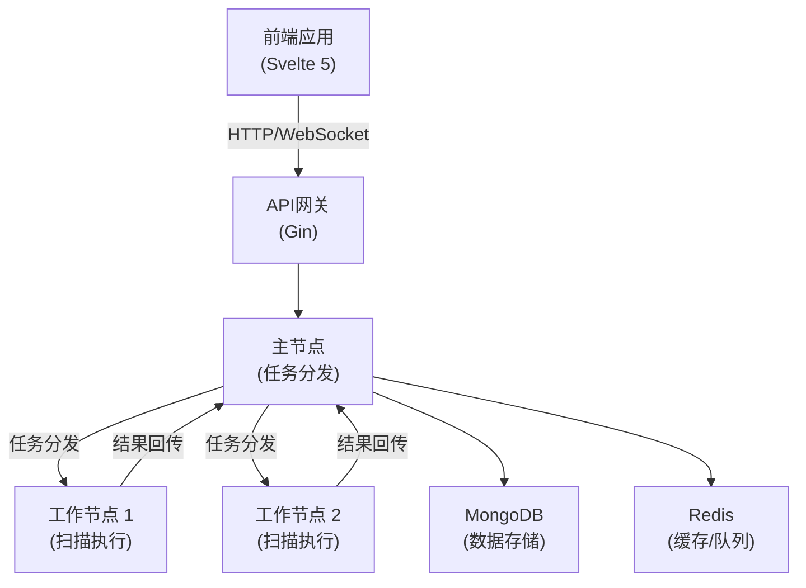

# Stellar (星络) - 分布式安全资产管理和漏洞扫描平台


## 项目概述

Stellar (星络) 是一个基于 Go 语言重构的分布式安全资产管理和漏洞扫描平台，是 ScopeSentry 项目的全新版本。平台采用现代化的技术栈和架构设计，提供更高效的资产发现、漏洞扫描和安全监控能力。

### 核心特性

- 🌟 **分布式架构**：支持多节点协同工作，提供更强大的扫描能力
- 🔍 **资产发现**：自动化资产测绘和指纹识别
- 🔐 **漏洞扫描**：内置多种漏洞检测模块
- 🌐 **子域名枚举**：全面的子域名收集和验证
- 📡 **端口扫描**：高效的端口扫描和服务识别
- 🔎 **敏感信息检测**：自动发现敏感数据泄露
- 🕷️ **网页爬虫**：智能网站内容采集
- 👀 **页面监控**：实时监控网页变更
- 🔌 **插件系统**：支持自定义扩展功能

## 技术架构

### 后端技术栈

- **语言框架**: Go 1.21+ + Gin
- **数据存储**: MongoDB + Redis
- **消息队列**: Redis Stream
- **认证授权**: JWT
- **日志系统**: zerolog
- **WebSocket**: gorilla/websocket

### 前端技术栈

- **框架**: Svelte 5 + SvelteKit 2+
- **构建工具**: Vite 5+
- **UI组件**: shadcn-svelte + Tailwind CSS
- **状态管理**: Svelte 5 runes + TanStack Store
- **HTTP客户端**: Axios
- **表单处理**: Felte + Zod

## 系统架构



## 核心功能模块

### 1. 资产管理模块
- 资产发现和识别
- 资产分类和标签
- 资产关系图谱
- 资产变更监控

### 2. 漏洞扫描模块
- 漏洞检测引擎
- POC管理系统
- 漏洞验证系统
- 漏洞评分系统

### 3. 任务管理模块
- 任务调度系统
- 任务分发机制
- 任务监控和告警
- 任务报告生成

### 4. 节点管理模块
- 节点健康监控
- 节点负载均衡
- 节点资源管理
- 节点认证授权

### 5. 监控告警模块
- 实时监控系统
- 告警规则配置
- 告警通知渠道
- 告警级别管理

## 项目结构

```
Stellar/
├── cmd/                    # 应用入口
├── internal/               # 内部包
│   ├── api/               # HTTP API处理器
│   ├── config/            # 配置管理
│   ├── database/          # 数据库连接
│   ├── models/            # 数据模型
│   ├── services/          # 业务逻辑
│   └── utils/             # 工具函数
├── web/                   # 前端应用
│   ├── src/
│   │   ├── lib/          # 组件和工具
│   │   └── routes/       # 页面路由
│   └── static/           # 静态资源
└── plugins/              # 插件目录
```

## 认证模块

Stellar 平台提供了完整的用户认证和授权系统，支持 JWT 令牌认证和基于角色的访问控制。

### 认证 API

#### 用户登录
```bash
POST /api/v1/auth/login
Content-Type: application/json

{
  "username": "user1",  // 用户名或邮箱
  "email": "user@example.com",  // 可选，支持邮箱登录
  "password": "password123"
}
```

响应：
```json
{
  "code": 200,
  "message": "登录成功",
  "data": {
    "token": "eyJhbGciOiJIUzI1NiIsInR5cCI6IkpXVCJ9...",
    "user": {
      "id": "507f1f77bcf86cd799439011",
      "username": "user1",
      "email": "user@example.com",
      "roles": ["user"],
      "created": "2024-01-01T00:00:00Z",
      "lastLogin": "2024-01-01T00:00:00Z"
    }
  }
}
```

#### 用户注册
```bash
POST /api/v1/auth/register
Content-Type: application/json

{
  "username": "newuser",
  "email": "newuser@example.com",
  "password": "password123"
}
```

响应格式与登录相同，注册成功后自动生成 JWT 令牌。

#### 获取用户信息
```bash
GET /api/v1/auth/info
Authorization: Bearer <token>
```

响应：
```json
{
  "code": 200,
  "data": {
    "username": "user1",
    "roles": ["user"]
  }
}
```

#### 用户登出
```bash
POST /api/v1/auth/logout
Authorization: Bearer <token>
```

响应：
```json
{
  "code": 200,
  "message": "登出成功"
}
```

### 前端状态管理

#### 认证状态存储
认证状态通过 Svelte 5 runes 和 stores 管理，支持：

- 用户登录状态持久化
- 自动令牌刷新机制
- 页面刷新后状态恢复
- 统一的错误处理

#### 使用示例
```typescript
import { auth } from '$lib/stores/auth';
import { authApi } from '$lib/api/auth';

// 登录
try {
  const response = await authApi.login({
    username: 'user1',
    password: 'password123'
  });
  
  if (response.code === 200 && response.data) {
    auth.login(response.data);
    // 自动跳转到应用主页
  }
} catch (error) {
  console.error('登录失败:', error);
}

// 登出
await auth.logout();

// 获取当前用户状态
const currentState = auth.state;
```

### 路由保护

#### 认证守卫
前端使用认证守卫保护需要登录的路由：

```typescript
// +layout.svelte (应用路由组)
import { authGuard } from '$lib/guards/auth.guard';

// 在页面加载时检查认证状态
authGuard.check();
```

#### 中间件保护
后端使用 JWT 中间件保护 API 路由：

```go
// 应用认证中间件
authGroup := router.Group("/api/v1")
authGroup.Use(AuthMiddleware())
{
    authGroup.GET("/projects", projectHandler.GetProjects)
    authGroup.POST("/projects", projectHandler.CreateProject)
    // 其他需要认证的路由...
}

// 支持角色权限控制
adminGroup := router.Group("/api/v1/admin")
adminGroup.Use(AuthMiddleware("admin"))
{
    adminGroup.GET("/users", userHandler.GetUsers)
    // 管理员专用路由...
}
```

### 错误处理

#### 统一错误响应
所有认证相关的错误都遵循统一的响应格式：

```json
{
  "code": 401,
  "message": "用户名或密码错误",
  "details": "具体错误信息"
}
```

#### 前端错误处理
前端通过 `APIError` 类处理 API 错误：

```typescript
import { APIError } from '$lib/api/auth';

try {
  await authApi.login(credentials);
} catch (error) {
  if (error instanceof APIError) {
    // 处理具体的 API 错误
    console.error(`错误 ${error.code}: ${error.message}`);
  } else {
    // 处理其他类型的错误
    console.error('未知错误:', error);
  }
}
```

### 交互流程

#### 登录流程
1. 用户在登录页面输入用户名/邮箱和密码
2. 前端调用 `/api/v1/auth/login` 接口
3. 后端验证用户凭据，生成 JWT 令牌
4. 前端接收令牌和用户信息，存储到 localStorage
5. 更新认证状态，跳转到应用主页

#### 自动认证流程
1. 页面加载时检查 localStorage 中的令牌
2. 如果存在令牌，恢复认证状态
3. 在 API 请求中自动添加 Authorization 头
4. 如果令牌过期，自动跳转到登录页面

#### 登出流程
1. 用户点击登出按钮
2. 前端调用 `/api/v1/auth/logout` 接口（可选）
3. 清理 localStorage 中的认证信息
4. 重置认证状态，跳转到登录页面

### 安全特性

- **密码加密**：使用 bcrypt 加密存储用户密码
- **JWT 令牌**：使用 HS256 算法签名，24小时有效期
- **角色权限**：支持基于角色的访问控制
- **输入验证**：严格的参数校验和数据验证
- **错误处理**：避免敏感信息泄露的错误响应

### 测试覆盖

认证模块拥有完整的测试覆盖，包括：

#### 后端测试覆盖
- **单元测试**：
  - JWT 生成和解析功能测试
  - 认证中间件权限验证测试
  - 登录/注册/登出 API 测试
  - 错误处理和异常情况测试
  - 角色权限控制测试

- **测试场景**：
  - 用户名和邮箱登录
  - 无效参数验证
  - JWT 令牌过期处理
  - 权限不足访问控制
  - 数据库连接异常处理

#### 前端测试覆盖
- **API 客户端测试**：
  - 所有认证 API 方法的成功和失败场景
  - APIError 异常处理测试
  - 网络错误处理测试
  - 参数验证测试

- **状态管理测试**：
  - 认证状态的初始化和更新
  - localStorage 持久化存储
  - 登录/登出状态变更
  - 令牌刷新机制测试

#### 端到端测试覆盖
- **完整认证流程**：
  - 用户注册流程测试
  - 登录成功和失败场景
  - 状态持久化验证
  - 页面刷新后状态恢复
  - 登出清理验证

#### 运行测试

```bash
# 运行所有测试
make test-all

# 单独运行后端测试
make test-backend

# 单独运行前端测试
make test-frontend

# 运行前端测试覆盖率
make test-frontend-coverage

# 运行端到端测试（需要开发环境运行）
make test-e2e
```

#### 测试覆盖率目标
- **后端测试覆盖率**：目标 80%+
- **前端测试覆盖率**：目标 85%+
- **端到端测试**：覆盖所有主要用户流程

## 开发计划

详细的开发计划请参考 [DEV_PLAN.md](./DEV_PLAN.md)。

## 快速开始

### 环境要求

- Go 1.21+
- Node.js 20+
- MongoDB 6.0+
- Redis 7.0+

### 本地开发

```bash
# 克隆项目
git clone https://github.com/your-org/stellar.git
cd stellar

# 安装后端依赖
go mod download

# 安装前端依赖
cd web
pnpm install

# 启动开发服务器
./start-dev.bat
```

## 贡献指南

欢迎提交 Issue 和 Pull Request 来帮助改进项目。

## 开源协议

本项目采用 MIT 协议开源。

## 前端技术栈

- Svelte ^5.7.0
- SvelteKit ^2.0.0
- Vite ^6.0.0
- TypeScript ^5.0.0
- TanStack Store ^0.7.1
- shadcn-svelte ^0.9.0
- Tailwind CSS ^3.4.1
- Axios ^1.6.0

## 开发环境要求

- Node.js 20+
- pnpm 8+ 