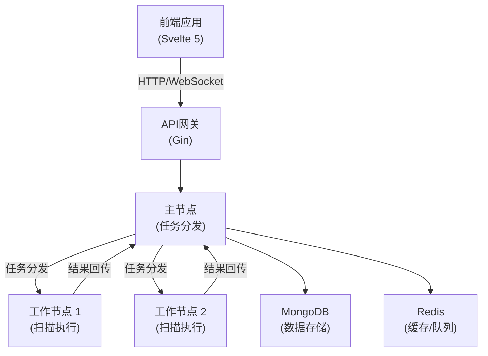

# Stellar (星络) - 分布式安全资产管理和漏洞扫描平台


## 项目概述

Stellar (星络) 是一个基于 Go 语言重构的分布式安全资产管理和漏洞扫描平台，是 ScopeSentry 项目的全新版本。平台采用现代化的技术栈和架构设计，提供更高效的资产发现、漏洞扫描和安全监控能力。

### 核心特性

- 🌟 **分布式架构**：支持多节点协同工作，提供更强大的扫描能力
- 🔍 **资产发现**：自动化资产测绘和指纹识别
- 🔐 **漏洞扫描**：内置多种漏洞检测模块
- 🌐 **子域名枚举**：全面的子域名收集和验证
- 📡 **端口扫描**：高效的端口扫描和服务识别
- 🔎 **敏感信息检测**：自动发现敏感数据泄露
- 🕷️ **网页爬虫**：智能网站内容采集
- 👀 **页面监控**：实时监控网页变更
- 🔌 **插件系统**：支持自定义扩展功能

## 技术架构

### 后端技术栈

- **语言框架**: Go 1.21+ + Gin
- **数据存储**: MongoDB + Redis
- **消息队列**: Redis Stream
- **认证授权**: JWT
- **日志系统**: zerolog
- **WebSocket**: gorilla/websocket

### 前端技术栈

- **框架**: Svelte 5 + SvelteKit 2+
- **构建工具**: Vite 5+
- **UI组件**: shadcn-svelte + Tailwind CSS
- **状态管理**: Svelte 5 runes + TanStack Store
- **HTTP客户端**: Axios
- **表单处理**: Felte + Zod

## 系统架构



## 核心功能模块

### 1. 资产管理模块
- 资产发现和识别
- 资产分类和标签
- 资产关系图谱
- 资产变更监控

### 2. 漏洞扫描模块
- 漏洞检测引擎
- POC管理系统
- 漏洞验证系统
- 漏洞评分系统

### 3. 任务管理模块
- 任务调度系统
- 任务分发机制
- 任务监控和告警
- 任务报告生成

### 4. 节点管理模块
- 节点健康监控
- 节点负载均衡
- 节点资源管理
- 节点认证授权

### 5. 监控告警模块
- 实时监控系统
- 告警规则配置
- 告警通知渠道
- 告警级别管理

## 项目结构

```
Stellar/
├── cmd/                    # 应用入口
├── internal/               # 内部包
│   ├── api/               # HTTP API处理器
│   ├── config/            # 配置管理
│   ├── database/          # 数据库连接
│   ├── models/            # 数据模型
│   ├── services/          # 业务逻辑
│   └── utils/             # 工具函数
├── web/                   # 前端应用
│   ├── src/
│   │   ├── lib/          # 组件和工具
│   │   └── routes/       # 页面路由
│   └── static/           # 静态资源
└── plugins/              # 插件目录
```

## 开发计划

详细的开发计划请参考 [DEV_PLAN.md](./DEV_PLAN.md)。

## 快速开始

### 环境要求

- Go 1.21+
- Node.js 20+
- MongoDB 6.0+
- Redis 7.0+

### 本地开发

```bash
# 克隆项目
git clone https://github.com/your-org/stellar.git
cd stellar

# 安装后端依赖
go mod download

# 安装前端依赖
cd web
pnpm install

# 启动开发服务器
./start-dev.bat
```

## 贡献指南

欢迎提交 Issue 和 Pull Request 来帮助改进项目。

## 开源协议

本项目采用 MIT 协议开源。

## 前端技术栈

- Svelte ^5.7.0
- SvelteKit ^2.0.0
- Vite ^6.0.0
- TypeScript ^5.0.0
- TanStack Store ^0.7.1
- shadcn-svelte ^0.9.0
- Tailwind CSS ^3.4.1
- Axios ^1.6.0

## 开发环境要求

- Node.js 20+
- pnpm 8+ 